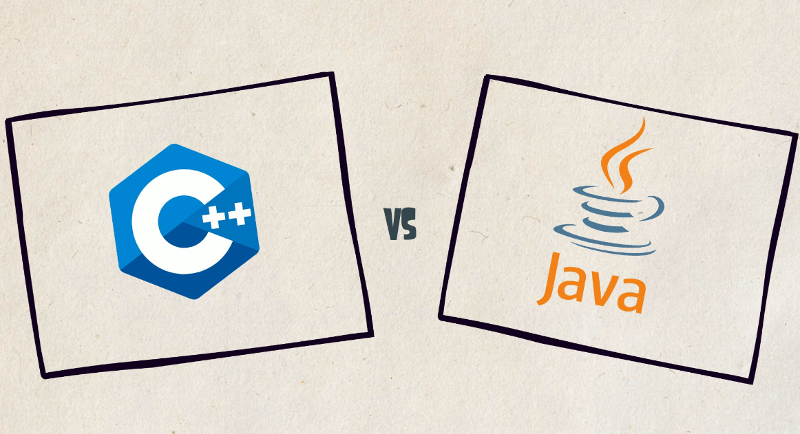
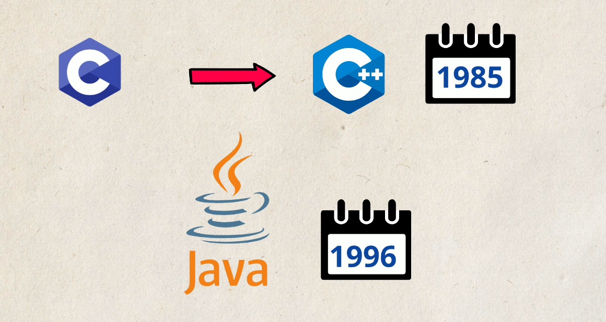
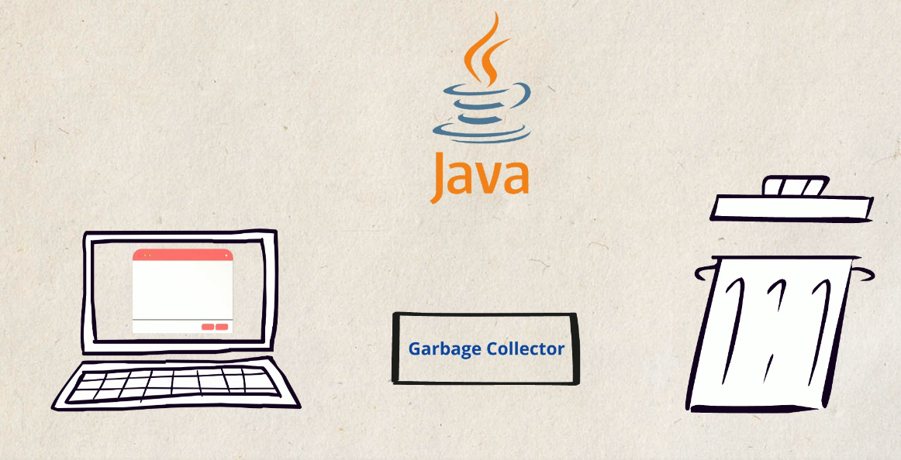
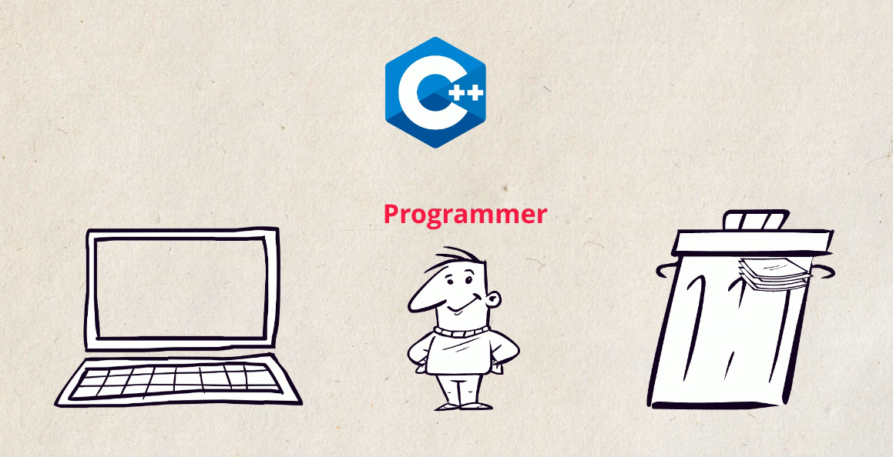
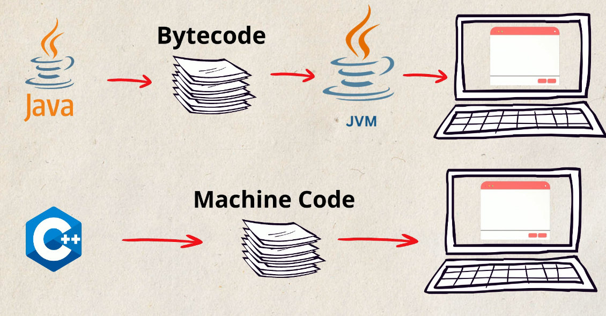
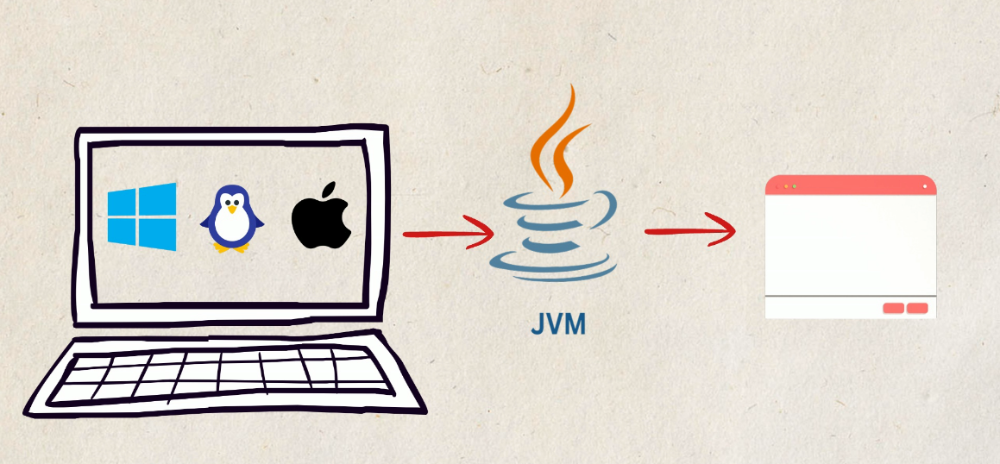
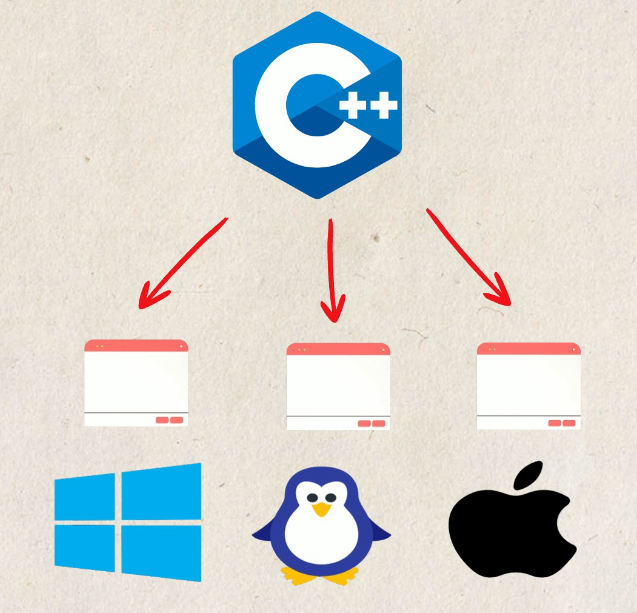

# Java vs C++ : Comprendre les différences

## Introduction
 ### Java et C++ sont deux langages de programmation largement utilisés, mais ils présentent des différences fondamentales dans leur conception, leur fonctionnement et leurs domaines d’application. Alors que C++ est souvent qualifié de langage de programmation compilé et orienté vers la performance, Java repose sur une machine virtuelle (**JVM**) qui favorise la portabilité et la sécurité. 

#### Cet article explore ces distinctions pour mieux comprendre pourquoi et comment chaque langage est utilisé dans le développement logiciel.
 
 
 

 
 
 

---

## 1. Différences au niveau de la mémoire
L’une des principales différences entre Java et C++ réside dans la gestion de la mémoire :

| **Aspect**      | **Java** | **C++** |
|----------------|---------|--------|
| **Allocation** | Automatique avec le **Garbage Collector** | Manuelle avec `new` et `delete` |
| **Pointeurs**  | Pas d’accès direct aux pointeurs | Utilisation explicite des pointeurs |
| **Empilement & Tas** | Les objets sont alloués sur le **tas** et nettoyés automatiquement | L’utilisateur gère la mémoire allouée sur le tas |
| **Performance mémoire** | Moins efficace à cause du garbage collector | Plus rapide avec allocation optimisée |

📌 **Java privilégie la sécurité et la facilité d’utilisation**, tandis que **C++ offre un contrôle total sur la mémoire**.
 
 
 

 
 
 

---

## 2. Différences au niveau de la compilation

| **Aspect**       | **Java** | **C++** |
|-----------------|---------|--------|
| **Compilation** | Converti en **bytecode** exécuté par la JVM | Compilé directement en code machine |
| **Interprétation** | Nécessite une JVM pour exécuter le programme | Le programme compilé est exécutable directement |
| **Portabilité** | "Écrit une fois, exécuté partout" | Dépend du système cible |
| **Optimisation** | **JIT (Just-In-Time compiler)** pour optimiser dynamiquement | Optimisé à la compilation |

 
 
 

🔹 Java est **plus portable**, tandis que C++ est **plus performant** en exécution.

---

## 3. Différences au niveau des plateformes

### - **Java** est indépendant de la plateforme grâce à la **JVM**, qui permet d’exécuter le même programme sur différents systèmes d’exploitation (Windows, Linux, macOS).

 
 
 

### - **C++** produit un code compilé spécifique à un OS et une architecture matérielle.

 

📌 **Exemple** : Un programme Java fonctionne sur n’importe quelle machine avec une JVM. Un programme C++ compilé pour Windows ne marchera pas sous Linux sans recompilation.

---

## 4. Domaines d’application de Java et C++

| **Domaine** | **Java** | **C++** |
|------------|---------|--------|
| **Développement Web** | 🌐 Très utilisé (Spring, Hibernate) | ❌ Rarement utilisé |
| **Applications mobiles** | 📱 Principal langage Android | ❌ Rarement utilisé |
| **Jeux vidéo** | 🎮 Peu performant pour le rendu graphique | 🚀 Utilisé pour les jeux AAA (Unreal Engine, CryEngine) |
| **Systèmes embarqués** | ❌ Moins adapté | ✅ Favorisé pour les systèmes embarqués |
| **Logiciels de bureau** | 💻 Utilisé avec JavaFX ou Swing | 🖥️ Couramment utilisé (Adobe, Microsoft Office) |
| **Applications financières** | 🏦 Très utilisé dans les banques | 📈 Trading haute fréquence |
| **Systèmes d’exploitation** | ❌ Inadapté | 🛠️ Utilisé pour Windows, Linux, macOS |

📌 **Java est privilégié pour les applications Web et mobiles, tandis que C++ domine dans les jeux, systèmes embarqués et logiciels lourds.**

---

## Conclusion
Java et C++ sont deux langages puissants, mais chacun répond à des besoins différents :

- **Java** 🟢 : **Portabilité élevée**, **gestion mémoire automatique**, **sécurité renforcée**.
- **C++** 🔵 : **Performance optimisée**, **contrôle mémoire**, **utilisation pour les systèmes bas niveau**.

🔹 **Le choix entre Java et C++ dépend des besoins du projet et des priorités du développeur !** 🚀

